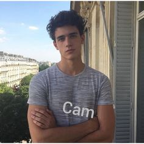

     

      
      <h1>SANG HYEOK LEE :) </h1>
      
TEL. 010-1234-7898  | E-mail. web123@gmail.com
                      Address. 10-1, Baengnyong-ro, Dong-gu, Daejeon
      

      
스프링 프레임 워크를 활용하여 높은 수준의 개요에 대한 강력한 시놉십스를 제공한 경험이 있습니다. 
         기업 전략에 대한 반복적인 접근 방힉은 전체적인 가치 제안을 추진하기 위한 협업적 사고를 촉진합니다.
      

